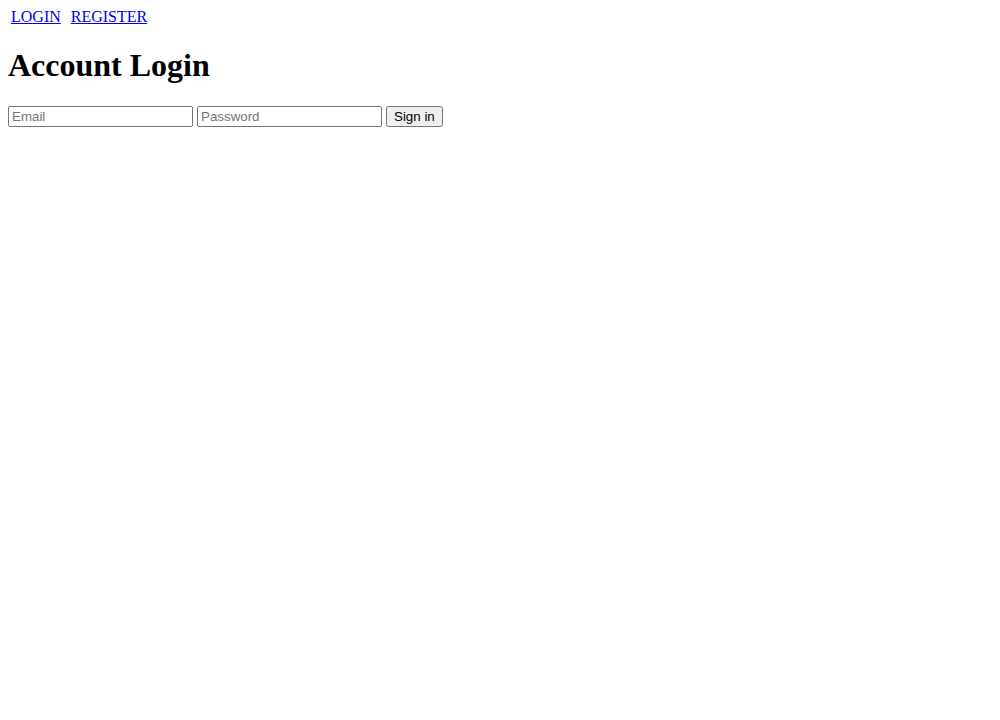
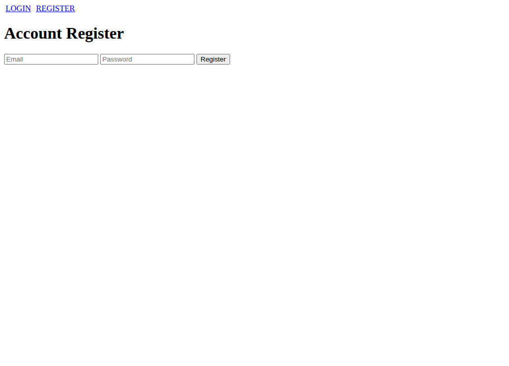
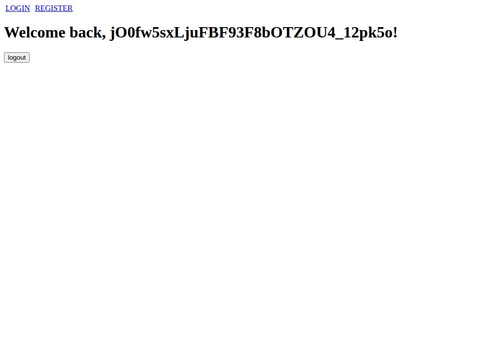

# frontend-auth-template

前端網頁使用的**可移植使用者認證功能模板**，基於 Express.js + TypeScript + Session 實作，可作為新專案的認證起點直接整合或參考。

## 功能

- **Session 認證**：使用 `express-session` 管理登入狀態，Cookie 有效期可調整
- **路由守衛（Auth Middleware）**：未登入時自動導向登入頁
- **Handlebars 模板引擎**：提供登入、註冊、歡迎頁面的伺服器端渲染
- **靜態資源支援**：Express 靜態檔案服務
- TypeScript 全覆蓋，型別安全

## 畫面截圖

| 登入頁 | 註冊頁 | 歡迎頁（登入後）|
|--------|--------|----------------|
|  |  |  |

> 截圖於本機 `npm run dev` 啟動後擷取。樣式採用 Bootstrap CDN，若於離線環境瀏覽，畫面會以未套用 CSS 的原始樣貌呈現，但功能不受影響。

## 技術棧

| 層級 | 套件 |
|------|------|
| 框架 | [Express.js 4](https://expressjs.com/) |
| 語言 | TypeScript 5 |
| 模板引擎 | express-handlebars |
| 認證 | express-session |
| 開發工具 | nodemon + concurrently + gts |

## 快速開始

### 安裝依賴

```bash
npm install
```

### 啟動開發模式（自動重載）

```bash
npm run dev
```

開啟 [http://localhost:3000](http://localhost:3000)

### 頁面路由

| 路由 | 說明 |
|------|------|
| `GET /` | 登入頁面 |
| `POST /` | 登入處理 |
| `GET /register` | 註冊頁面 |
| `POST /register` | 註冊處理 |
| `GET /welcome` | 歡迎頁（需登入）|
| `GET /logout` | 登出並清除 Session |

### 建置 Production

```bash
npm run compile   # 編譯 TypeScript → build/
```

## 專案結構

```
src/
└── index.ts          # 主要伺服器邏輯（路由、middleware、session 設定）
views/
├── layouts/
│   └── main.handlebars  # 全域版面
├── login.handlebars
├── register.handlebars
└── welcome.handlebars
build/                # 編譯輸出（TypeScript → JS）
```

## 自訂認證邏輯

目前使用記憶體內陣列模擬使用者資料庫，替換為真實資料庫只需修改 `src/index.ts` 中的認證邏輯：

```typescript
// 替換這裡為資料庫查詢
const user = users.find(u => u.email === email && u.password === password);
```

> **注意：** 此模板為教學示範用途，生產環境請務必使用雜湊密碼（如 bcrypt）並使用持久化 Session 儲存（如 connect-mongo）。

## 授權

Apache-2.0